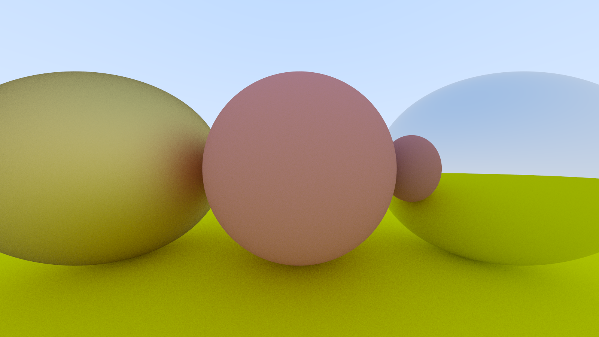

# Cool Ray Tracer

A software ray tracer for learning purposes.

## Todo

- [ ] Refractions
- [ ] Load arbitrary models instead of just spheres
- [ ] Enhace camera
- [ ] Defocus blur
- [ ] Multithreading
- [ ] Realtime feedback. Render to a window which shows the image even if it isn't yet finished
- [ ] Render target to a iamge object which can b saved in any format (not just ppm)